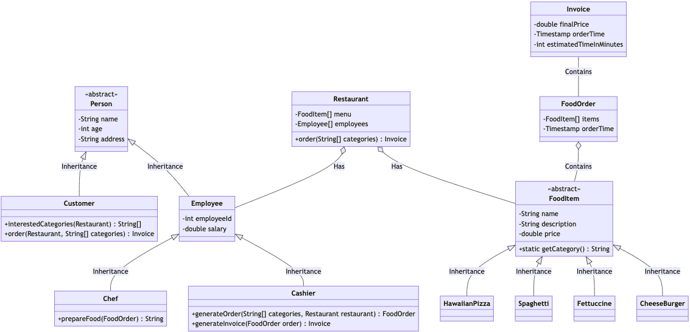

# Food Service Simulation
- 概要
  - phpを使用して、オブジェクト指向プログラミング練習用のディレクトリ
- 目的
  - オブジェクト指向プログラミングの四大柱（カプセル化、抽象化、継承、ポリモーフィズム）に関わるコードを書き、PHP の構文を出力し練習する。

- 構成

- 実行コマンド
  - /src配下に移動し、`php main.php`を実行する